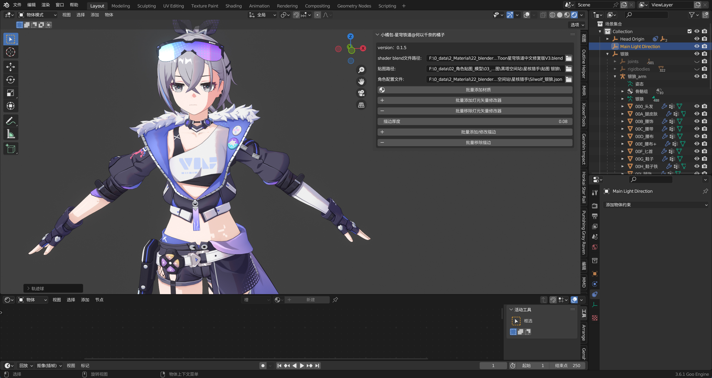
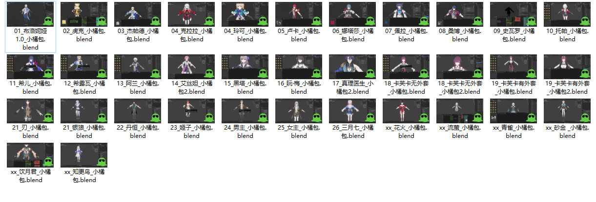
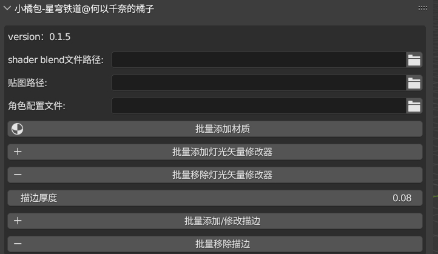
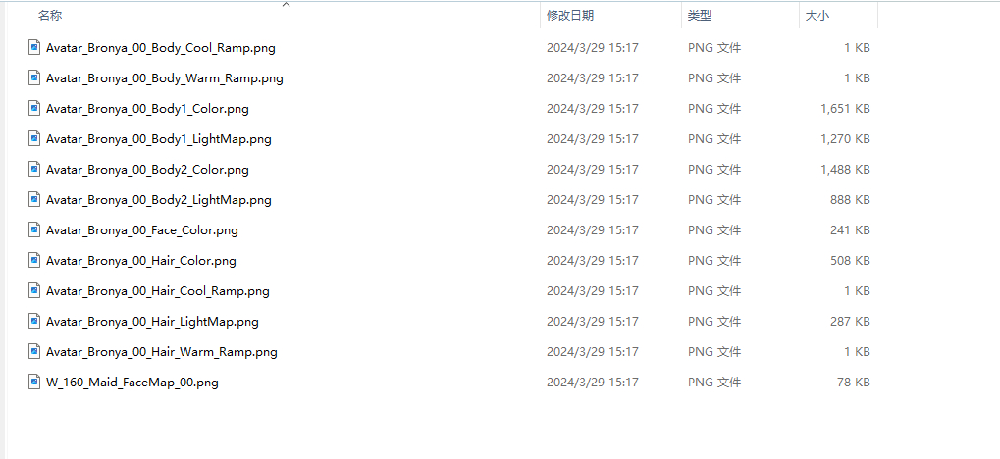

# 给星穹铁道MMD模型批量添加材质和描边的Blender插件

<p align="center">


</p>

<p align="center">
中文 | <a href="README_EN.md">English</a>
</p>

- [给星穹铁道MMD模型批量添加材质和描边的Blender插件](#给星穹铁道mmd模型批量添加材质和描边的blender插件)
  - [说明](#说明)
  - [功能](#功能)
  - [安装](#安装)
    - [方式一：zip 方式安装（推荐）](#方式一zip-方式安装推荐)
    - [方式二：解压后安装](#方式二解压后安装)
  - [使用](#使用)
    - [使用教程](#使用教程)
    - [贴图数据说明](#贴图数据说明)
    - [角色配置文件说明](#角色配置文件说明)
    - [使用代码构建角色配置文件](#使用代码构建角色配置文件)
  - [常见问题](#常见问题)
  - [规则](#规则)
  - [致谢](#致谢)
  - [支持](#支持)





1. 此插件结合以下***仿星穹铁道 Shader***一起使用：

   - Festivity's Honkai: Star Rail Shader，地址：https://github.com/festivities/Blender-StellarToon

   - 克里斯提亚娜大佬的汉化修复，下载地址：https://pan.baidu.com/s/1JKwny2CkdfSmqR1jT51BiQ?from=init&pwd=26JU  **用这个** 


   - 补一个下载链接：[StellarToon星穹铁道中文修复版V3.blend](https://1drv.ms/u/s!AihGDbeGMmo3j5kJijuoFCh-PkxHtw?e=4XHsm1)


2. 此插件需要的**角色配置文件**：

   - [xiaojubao插件-星穹铁道-角色配置文件夹2024-05-08.zip](https://1drv.ms/u/s!AihGDbeGMmo3j5kQuY8A1PBqbN1g5Q?e=VVNO3Z) 提取码：`%Tme5`（**包含55个角色的配置文件，都是我一个一个配置的**）

   - 下文有如何制作配置文件的教程，没有的可以自己配一下(≧﹏ ≦) 

⭐ 如果你觉得有用的话，可以给这个仓库点个 **Star**  ⭐

🔋支持一下，[Bilibli@何以千奈的橘子](https://space.bilibili.com/41350412) ，[爱发电@何以千奈的橘子](https://afdian.net/a/xiaojubao)🔋


测试过的模型：（肝不动了＞﹏＜



## 说明

- ***StellarToon Shader 仅支持 Blender GooEngine  分支***
- GooEngine 3.6 环境下开发，其他版本自行测试看看，反馈给我下

## 功能

- 批量给模型添加 ***Blender-StellarToon Shader***，修改了原有默认的**面部阴影**和**身体边缘光厚度**
- 批量给模型添加/移除 **灯光矢量修改器**
- 批量给模型添加/移除 ***Blender-StellarToon 描边***，将**描边厚度**作为参数暴露了出来，方便修改

插件截图



后续更新：

- [ ] 武器
- [ ] 面部描边修复
...
- 可以关注下，后续也会做其他的工具插件

## 安装

### 方式一：zip 方式安装（推荐）

[下载 - xiaojubao-honkai-star-rail.zip](https://github.com/foxlynna/xiaojubao-honkai-star-rail/releases)

下载 zip 直接在Blender 插件管理面板安装，**不用解压**。

### 方式二：解压后安装

解压后自行放入Blender插件文件夹，一般是 `用户\AppData\Roaming\Blender Foundation\Blender\你的版本号\scripts\addons`下

## 使用

### 使用教程

[教程 - @何以千奈的橘子 bilibili](https://www.bilibili.com/video/BV1JT421X7v3)


安装后，打开 N 窗，出现 ***XiaoJu*** 标签页。

- ***shader blend 文件路径***：输入下载的 festivity Blender-StellarToon blend 文件 `StellarToon星穹铁道中文修复版V3.blend`
- ***角色的贴图路径*** - 贴图数据说明见下文
- ***角色的配置文件*** - 配置 ***MMD 模型***  各部分***网格名称与Sharder的映射*** - 下载以及如何配置见下文
- 注：填入的路径参数会缓存下来，关闭项目后，下次打开空项目会自动填入 ψ(｀∇´)ψ 会方便很多

- 选中角色的网格对象，点击各个按钮开始梭哈......ヾ(≧▽≦*)o

### 贴图数据说明

- 角色贴图单独放一个文件夹下
- 一般应该包含：（以布洛妮娅 贴图为例：）
  - 脸部贴图：
    - W_160_Maid_FaceMap_00.png      
    - Avatar_Bronya_00_Face_Color.png
  - 头发贴图
    - Avatar_Bronya_00_Hair_Color.png
    - Avatar_Bronya_00_Hair_Cool_Ramp.png
    - Avatar_Bronya_00_Hair_Warm_Ramp.png
    - Avatar_Bronya_00_Hair_LightMap.png
  - 身体贴图（有的模型不分Body1、2）
    - Avatar_Bronya_00_Body_Cool_Ramp.png
    - Avatar_Bronya_00_Body_Warm_Ramp.png
    - Avatar_Bronya_00_Body1_Color.png
    - Avatar_Bronya_00_Body1_LightMap.png
    - Avatar_Bronya_00_Body2_Color.png
    - Avatar_Bronya_00_Body2_LightMap.png
- 插件匹配贴图使用的关键字：FaceMap、Face_Color、Hair_Color、Hair_Cool_Ramp、Hair_Warm_Ramp、Hair_LightMap、Body_Cool_Ramp、Body_Warm_Ramp、Body1_Color、Body1_LightMap、Body2_Color、Body2_LightMap、Body_Color、Body_LightMap；
- **所以贴图最好不要有重复的关键字，或者不一致的关键字**。注：**代码中有处理一部分逻辑，但是最好检查一下**，修改正确。




### 角色配置文件说明

由于MMD的模型按材质分开后，网格很多，为每个网格正确地映射Shader，所以添加了这么一个配置文件。

结构如下：主要是使用 `face/hair/body/body1/body2` 这些Key去映射对应的 Shader。**注：只有Key下面的网格才会被添加Shader**。

- face 对应使用 面部 Shader
- hair 对应使用 头发 Shader
- body/body1/body2 对应使用 身体的 Shader

```json
{
    "role_name": "Bronya_布洛妮娅",
    "material_map": {
        "表情": [
            "表情"
        ],
        "body1": [
            "衣饰",
            "胸饰",
            "袖子",
            "袖子饰",
            "袖子带",
            "袖子带饰",
            "袖子带1",
            "内衣",
            "衣服",
            "手套",
            "耳环",
            "头饰",
            "头饰铁",
            "皮肤"
        ],
        "body2": [
            "腿甲",
            "鞋子",
            "鞋子1",
            "丝袜",
            "衣饰1",
            "裙饰",
            "裙子",
            "裙子1"
        ],
        "裙内侧": [
            "裙子内侧"
        ],
        "hair": [
            "头发"
        ],
        "face": [
            "脸",
            "眉毛",
            "牙齿",
            "舌头",
            "口腔",
            "眼白",
            "眼睛",
            "眼睛1"
        ]
    }
}
```

### 使用代码构建角色配置文件

1. 将代码到复制到***blender 脚本页面*** 

2. 修改代码中的**输出路径、输出文件名**

3. **选中角色的网格**后执行代码生成配置文件。

4. 修改配置文件的key为：`face/hair/body/body1/body2`

```python
import json
import os
import bpy

def collect_image_references():
    """read original model material and collect tex image"""
    image_map = {}
    for obj in bpy.context.selected_objects:
        if obj.type == 'MESH':
            if obj.material_slots:
                for slot in obj.material_slots:
                    if slot.material and slot.material.use_nodes:
                        nodes = slot.material.node_tree.nodes
                        for node in nodes:
                            if node.type == 'TEX_IMAGE' and node.image:
                                image_name = node.image.name
                                # remove .png
                                if image_name.lower().endswith('.png'):
                                    image_name = image_name[:-4]
                                # get mesh name and split by '_'
                                mesh_name_parts = obj.name.split('_')
                                if len(mesh_name_parts) > 1:
                                    mesh_name = mesh_name_parts[1]
                                else:
                                    mesh_name = mesh_name_parts[0]
                                if image_name not in image_map:
                                    image_map[image_name] = []
                                if mesh_name not in image_map[image_name]:
                                    image_map[image_name].append(mesh_name)
    print(image_map)
    return image_map

def write_role_json(role_name, image_map, filepath):
    """write_role_json to json file"""
    full_file_path = os.path.join(filepath, f"{role_name}.json")
    print(full_file_path)
    # data structure
    data_to_write = {
        "role_name": role_name,
        "material_map": {
            
        }
    }
    # image_map add to data
    for key, value in image_map.items():
        data_to_write["material_map"][key] = value
        
    # Ensure the directory exists
    os.makedirs(os.path.dirname(full_file_path), exist_ok=True)
    # Write json
    with open(full_file_path, 'w', encoding='utf-8') as json_file:
        json.dump(data_to_write, json_file, ensure_ascii=False, indent=4)
    print(f"Data successfully written to {full_file_path}")

path = "写出的路径"
write_role_json("Bronya_布洛妮娅", collect_image_references(), path)    
```


## 常见问题

- 贴图名称错误：如：有的身体贴图没有`Body`字段
- 贴图关键字名称重复：如：身体贴图包含：`Body_Color`、`Body_Color_L`，插件有处理这部分逻辑

- 部分材质没上是暗色的，分析情况，可手动切换到正确的材质球

- ...

- 解决不了可提issue，或者B站私信我。[@何以千奈的橘子](https://space.bilibili.com/41350412) 


## 规则

- AGPL 3.0 licence
- 如果使用此插件，可以声明Shader作者 [festivity](https://github.com/festivities)，汉化修复：[克里斯提亚娜](https://space.bilibili.com/322607631?spm_id_from=333.788.0.0)，插件作者：[何以千奈的橘子](https://space.bilibili.com/41350412) 


## 致谢

- [festivity](https://github.com/festivities)

- [克里斯提亚娜](https://space.bilibili.com/322607631?spm_id_from=333.788.0.0)

- [HoYoverse](https://www.hoyoverse.com/)

- [DillonGoo Studios](https://www.dillongoostudios.com/)


## 支持

制作不易，感谢。

🔋支持一下，[Bilibli@何以千奈的橘子](https://space.bilibili.com/41350412) ，[爱发电@何以千奈的橘子](https://afdian.net/a/xiaojubao)🔋


