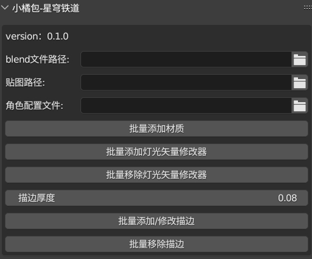
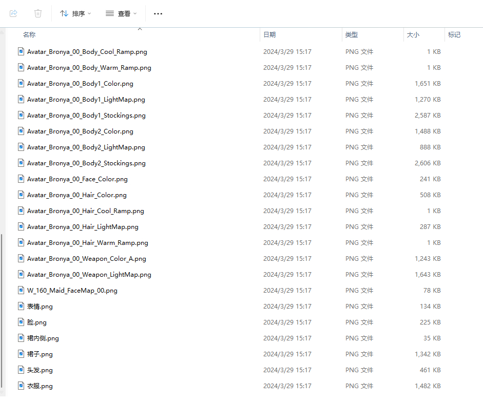

# 批量给星穹铁道MMD模型添加材质和描边的Blender插件

<p align="center">


</p>   


- [批量给星穹铁道MMD模型添加材质和描边的Blender插件](#批量给星穹铁道mmd模型添加材质和描边的blender插件)
  - [功能/说明](#功能说明)
  - [安装](#安装)
    - [zip 方式安装](#zip-方式安装)
    - [解压后安装](#解压后安装)
    - [下载 **festivity** **Blender-StellarToon**](#下载-festivity-blender-stellartoon)
  - [使用](#使用)
    - [使用教程](#使用教程)
    - [贴图数据说明](#贴图数据说明)
    - [角色配置文件说明](#角色配置文件说明)
    - [使用代码构建角色配置文件](#使用代码构建角色配置文件)
  - [规则](#规则)
  - [致谢](#致谢)
  - [支持](#支持)


## 功能/说明

- **仅支持 GooEngine Blender 分支**
- 配合 **festivity** **Blender-StellarToon** 使用
- 批量给模型添加 **Blender-StellarToon** Shader，修改了原有默认的**面部阴影**和**身体边缘光厚度**
- 批量给模型添加/移除 **灯光矢量修改器**
- 批量给模型添加/移除 **Blender-StellarToon** 描边，将**描边厚度**作为参数暴露了出来，方便修改

插件截图




## 安装

### zip 方式安装

下载 zip 直接在Blender 插件管理面板安装，**不用解压**。

### 解压后安装

解压后自行放入Blender插件文件夹，一般是 `用户\AppData\Roaming\Blender Foundation\Blender\3.6\scripts\addons`下

### 下载 **festivity** **Blender-StellarToon** 

[**festivity** **Blender-StellarToon**  Github项目地址](https://github.com/festivities/Blender-StellarToon)

[克里斯提亚娜 大佬的汉化修复下载地址 - 百度网盘](https://pan.baidu.com/share/init?surl=JKwny2CkdfSmqR1jT51BiQ&pwd=26JU) - **下载这个**

[克里斯提亚娜 大佬的 festivity Blender-StellarToon 使用教程](https://www.bilibili.com/video/BV1pW421A7Yz/?spm_id_from=333.999.0.0&vd_source=3ea4b8cada48ac13acbca4da8d719890)


## 使用

### 使用教程

[教程 - @何以千奈的橘子 bilibili] 待更新


安装后，打开 N 窗，出现 ***XiaoJu*** 标签页。

- blend 文件路径：输入下载的 festivity Blender-StellarToon blend 文件
- 角色的贴图路径 - 贴图数据说明见下文
- 角色的配置文件 - 配置MMD模型各部分网格名称与Sharder的映射 - 如何配置见下文


选中角色的网格对象，点击各个按钮开始梭哈......

### 贴图数据说明

- 角色贴图单独放一个文件夹下
- 一般应该包含：（以布洛妮娅 贴图为例：）
  - 脸部贴图：
    - W_160_Maid_FaceMap_00.png      
    - Avatar_Bronya_00_Face_Color.png
  - 头发贴图
    - Avatar_Bronya_00_Hair_Color.png
    - Avatar_Bronya_00_Hair_Cool_Ramp.png
    - Avatar_Bronya_00_Hair_Warm_Ramp.png
    - Avatar_Bronya_00_Hair_LightMap.png
  - 身体贴图（有的模型不分Body1、2）
    - Avatar_Bronya_00_Body_Cool_Ramp.png
    - Avatar_Bronya_00_Body_Warm_Ramp.png
    - Avatar_Bronya_00_Body1_Color.png
    - Avatar_Bronya_00_Body1_LightMap.png
    - Avatar_Bronya_00_Body2_Color.png
    - Avatar_Bronya_00_Body2_LightMap.png




部分贴图结构不一样的，批量添加Shader后会导致贴图没上，可以添加Shader后**手动修改**。如：史瓦罗


### 角色配置文件说明

由于MMD的模型按材质分开后，网格很多，为每个网格正确地映射Shader，所以添加了这么一个配置文件。

结构如下：主要是 `face/hair/body/body1/body2` 

- face 对应使用 面部 Shader
- hair 对应使用 头发 Shader
- body/body1/body2 对应使用 身体的 Shader

```json
{
    "role_name": "Bronya_布洛妮娅",
    "material_map": {
        "表情": [
            "表情"
        ],
        "body1": [
            "衣饰",
            "胸饰",
            "袖子",
            "袖子饰",
            "袖子带",
            "袖子带饰",
            "袖子带1",
            "内衣",
            "衣服",
            "手套",
            "耳环",
            "头饰",
            "头饰铁",
            "皮肤"
        ],
        "body2": [
            "腿甲",
            "鞋子",
            "鞋子1",
            "丝袜",
            "衣饰1",
            "裙饰",
            "裙子",
            "裙子1"
        ],
        "裙内侧": [
            "裙子内侧"
        ],
        "hair": [
            "头发"
        ],
        "face": [
            "脸",
            "眉毛",
            "牙齿",
            "舌头",
            "口腔",
            "眼白",
            "眼睛",
            "眼睛1"
        ]
    }
}
```

### 使用代码构建角色配置文件

将代码到复制到blender中，选中角色的网格后执行代码生成配置文件。修改配置文件的key为：`face/hair/body/body1/body2`

**如果你嫌麻烦，可以去我的爱发电下载，更新中...（太肝了，制作不易，感谢支持）** [爱发电](https://afdian.net/a/xiaojubao)

```python
import json
import os
import bpy

def collect_image_references():
    """read original model material and collect tex image"""
    image_map = {}
    for obj in bpy.context.selected_objects:
        if obj.type == 'MESH':
            if obj.material_slots:
                for slot in obj.material_slots:
                    if slot.material and slot.material.use_nodes:
                        nodes = slot.material.node_tree.nodes
                        for node in nodes:
                            if node.type == 'TEX_IMAGE' and node.image:
                                image_name = node.image.name
                                # remove .png
                                if image_name.lower().endswith('.png'):
                                    image_name = image_name[:-4]
                                # get mesh name and split by '_'
                                mesh_name_parts = obj.name.split('_')
                                if len(mesh_name_parts) > 1:
                                    mesh_name = mesh_name_parts[1]
                                else:
                                    mesh_name = mesh_name_parts[0]
                                if image_name not in image_map:
                                    image_map[image_name] = []
                                if mesh_name not in image_map[image_name]:
                                    image_map[image_name].append(mesh_name)
    print(image_map)
    return image_map

def write_role_json(role_name, image_map, filepath):
    """write_role_json to json file"""
    full_file_path = os.path.join(filepath, f"{role_name}.json")
    print(full_file_path)
    # data structure
    data_to_write = {
        "role_name": role_name,
        "material_map": {
            
        }
    }
    # image_map add to data
    for key, value in image_map.items():
        data_to_write["material_map"][key] = value
        
    # Ensure the directory exists
    os.makedirs(os.path.dirname(full_file_path), exist_ok=True)
    # Write json
    with open(full_file_path, 'w', encoding='utf-8') as json_file:
        json.dump(data_to_write, json_file, ensure_ascii=False, indent=4)
    print(f"Data successfully written to {full_file_path}")

path = "写出的路径"
write_role_json("Bronya_布洛妮娅", collect_image_references(), path)    
```


## 规则

- AGPL 3.0 licence
- 如果使用此插件，可以声明Shader作者 [festivity](https://github.com/festivities)，汉化修复：[克里斯提亚娜](https://space.bilibili.com/322607631?spm_id_from=333.788.0.0)，插件作者：[何以千奈的橘子](https://space.bilibili.com/41350412) 


## 致谢

- [festivity](https://github.com/festivities)

- [克里斯提亚娜](https://space.bilibili.com/322607631?spm_id_from=333.788.0.0)

- [HoYoverse](https://www.hoyoverse.com/)

- [DillonGoo Studios](https://www.dillongoostudios.com/)


## 支持

制作不易，感谢。

[buy me coffee](https://afdian.net/a/xiaojubao)


