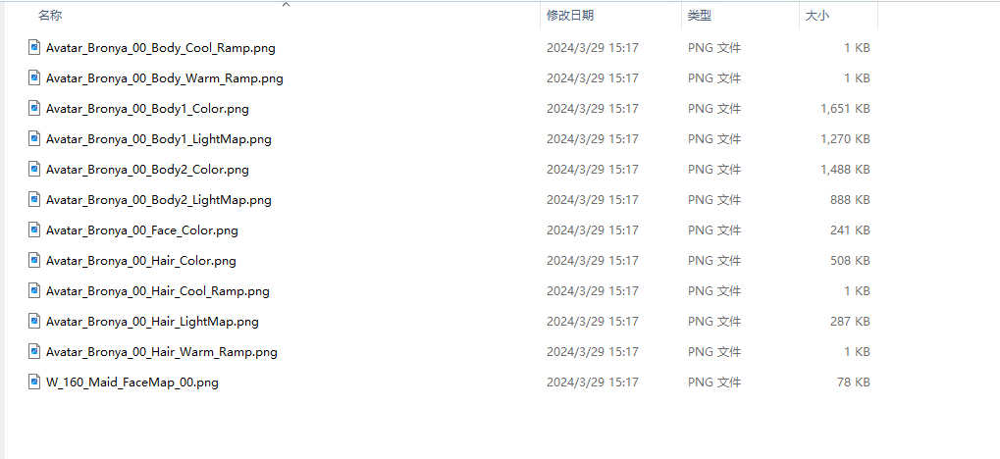

# Blender Plugin for Adding Materials and Outlines to Honkai: Star Rail MMD Models in Bulk

<p align="center">


</p>   

<p align="center">
<a href="README.md">中文</a> | English
</p>

- [Blender Plugin for Adding Materials and Outlines to Honkai: Star Rail MMD Models in Bulk](#blender-plugin-for-adding-materials-and-outlines-to-honkai-star-rail-mmd-models-in-bulk)
  - [Description](#description)
  - [Features](#features)
  - [Installation](#installation)
    - [Method 1: Install via ZIP (Recommended)](#method-1-install-via-zip-recommended)
    - [Method 2: Install After Extraction](#method-2-install-after-extraction)
  - [Usage](#usage)
    - [Tutorial](#tutorial)
    - [Texture Data Explanation](#texture-data-explanation)
    - [Character Configuration File Explanation](#character-configuration-file-explanation)
    - [Build Character Configuration Files with Code](#build-character-configuration-files-with-code)
  - [FAQ](#faq)
  - [Rules](#rules)
  - [Acknowledgments](#acknowledgments)
  - [Support](#support)


1. This plugin is meant to be used with the ***Honkai: Star Rail Shader*** listed below:

   - Festivity's Honkai: Star Rail Shader: https://github.com/festivities/Blender-StellarToon
   
   - **Use this:** MMD fix version: [StellarToon-MMD-fix.blend](https://1drv.ms/u/s!AihGDbeGMmo3j5kS72qjPrzETl1yBg?e=AxyNTh) Extract Code: `xiaojubao`
2. Required **Character Configuration Files** for this plugin:

   - [xiaojubao-plugin-Honkai-Star-Rail-Character-Configuration-Folder-2024-05-08.zip](https://1drv.ms/u/s!AihGDbeGMmo3j5kQuY8A1PBqbN1g5Q?e=VVNO3Z), Extract Code: `%Tme5` (**Contains configuration files for 55 characters that I configured one by one**)

   - The guide on how to create configuration files is below. If unavailable, you can configure them yourself (≧﹏≦).

⭐ If you find it helpful, please consider giving this repository a **Star** ⭐

<a href='https://ko-fi.com/mikotoayu' target='_blank'>


Tested models (exhausting ＞﹏＜):


## Description

- ***StellarToon Shader is only compatible with the Blender GooEngine branch***
- Developed under the GooEngine 3.6 environment. Test other versions yourself and let me know.

## Features

- Bulk application of ***Blender-StellarToon Shader*** to models, modifying the original default **facial Warm Shadow Color** and **body rim thickness**
- Bulk addition/removal of **Light Vector Modifiers** to models
- Bulk application/removal of ***Blender-StellarToon Outlines*** to models, exposing **outline thickness** as a parameter for easy adjustment

Plugin Screenshot:


Upcoming updates:

- [ ] Weapons
- [ ] Facial Outline Fixes
...

Stay tuned for other tool plugins.

## Installation

### Method 1: Install via ZIP (Recommended)

[Download english version - xiaojubao-honkai-star-rail-en.zip](https://github.com/foxlynna/xiaojubao-honkai-star-rail/releases)

Download the zip and install directly through the Blender add-on manager without extracting it.

### Method 2: Install After Extraction

Extract the contents and place them manually in the Blender add-ons folder, usually located at `User\AppData\Roaming\Blender Foundation\Blender\Your Version Number\scripts\addons`.

## Usage

### Tutorial

[Tutorial - @何以千奈的橘子 bilibili](https://www.bilibili.com/video/BV16z421m7GP/?vd_source=3ea4b8cada48ac13acbca4da8d719890).Only Chinese tutotail.

After installation, open the N window to find the ***XiaoJu*** tab.

- ***shader blend file path***: Enter the path to the downloaded festivity Blender-StellarToon blend file `StellarToon-MMD-fix.blend`
- ***Character's Texture Path***: See the following for texture data explanation.
- ***Character Configuration File***: Configuration mapping ***MMD models*** to the ***Shader*** - Configuration details below. Or use the files I've already configured.
- Note: Paths will be cached and automatically filled in when opening a new empty project ψ(｀∇´)ψ.

- Select the character's mesh objects and click the buttons to start configuring...ヾ(≧▽≦*)o

### Texture Data Explanation

- Put each character's textures in a separate folder.
- Typical files include (example using Bronya's textures):
  - Facial textures:
    - W_160_Maid_FaceMap_00.png      
    - Avatar_Bronya_00_Face_Color.png
  - Hair textures:
    - Avatar_Bronya_00_Hair_Color.png
    - Avatar_Bronya_00_Hair_Cool_Ramp.png
    - Avatar_Bronya_00_Hair_Warm_Ramp.png
    - Avatar_Bronya_00_Hair_LightMap.png
  - Body textures (some models do not distinguish Body1 and Body2):
    - Avatar_Bronya_00_Body_Cool_Ramp.png
    - Avatar_Bronya_00_Body_Warm_Ramp.png
    - Avatar_Bronya_00_Body1_Color.png
    - Avatar_Bronya_00_Body1_LightMap.png
    - Avatar_Bronya_00_Body2_Color.png
    - Avatar_Bronya_00_Body2_LightMap.png
- Keywords used for texture matching: FaceMap, Face_Color, Hair_Color, Hair_Cool_Ramp, Hair_Warm_Ramp, Hair_LightMap, Body_Cool_Ramp, Body_Warm_Ramp, Body1_Color, Body1_LightMap, Body2_Color, Body2_LightMap, Body_Color, Body_LightMap.
- **Avoid duplicate or inconsistent keywords in the textures.** Note: **The code handles some of the logic, but it's best to double-check and correct any errors.**



### Character Configuration File Explanation

MMD models have many meshes separated by material, so to map each mesh correctly to a Shader, a configuration file is provided.

The structure is as follows: mainly using keys like `face/hair/body/body1/body2` to map to the respective Shader. **Note: Only meshes under these keys will have the Shader applied.**

- `face`: maps to Facial Shader
- `hair`: maps to Hair Shader
- `body/body1/body2`: map to Body Shaders

```json
{
    "role_name": "Bronya_布洛妮娅",
    "material_map": {
        "表情": [
            "表情"
        ],
        "body1": [
            "衣饰",
            "胸饰",
            "袖子",
            "袖子饰",
            "袖子带",
            "袖子带饰",
            "袖子带1",
            "内衣",
            "衣服",
            "手套",
            "耳环",
            "头饰",
            "头饰铁",
            "皮肤"
        ],
        "body2": [
            "腿甲",
            "鞋子",
            "鞋子1",
            "丝袜",
            "衣饰1",
            "裙饰",
            "裙子",
            "裙子1"
        ],
        "裙内侧": [
            "裙子内侧"
        ],
        "hair": [
            "头发"
        ],
        "face": [
            "脸",
            "眉毛",
            "牙齿",
            "舌头",
            "口腔",
            "眼白",
            "眼睛",
            "眼睛1"
        ]
    }
}
```

### Build Character Configuration Files with Code

1. Copy the code to the ***Blender Script Editor***.
2. Modify the **output path and file name** in the code.
3. **Select the character mesh** and execute the code to generate the configuration file.
4. Adjust the file's key to: `face/hair/body/body1/body2`.

```
pythonCopy codeimport json
import os
import bpy

def collect_image_references():
    """read original model material and collect tex image"""
    image_map = {}
    for obj in bpy.context.selected_objects:
        if obj.type == 'MESH':
            if obj.material_slots:
                for slot in obj.material_slots:
                    if slot.material and slot.material.use_nodes:
                        nodes = slot.material.node_tree.nodes
                        for node in nodes:
                            if node.type == 'TEX_IMAGE' and node.image:
                                image_name = node.image.name
                                # remove .png
                                if image_name.lower().endswith('.png'):
                                    image_name = image_name[:-4]
                                # get mesh name and split by '_'
                                mesh_name_parts = obj.name.split('_')
                                if len(mesh_name_parts) > 1:
                                    mesh_name = mesh_name_parts[1]
                                else:
                                    mesh_name = mesh_name_parts[0]
                                if image_name not in image_map:
                                    image_map[image_name] = []
                                if mesh_name not in image_map[image_name]:
                                    image_map[image_name].append(mesh_name)
    print(image_map)
    return image_map

def write_role_json(role_name, image_map, filepath):
    """write_role_json to json file"""
    full_file_path = os.path.join(filepath, f"{role_name}.json")
    print(full_file_path)
    # data structure
    data_to write = {
        "role_name": role_name,
        "material_map": {
            
        }
    }
    # image_map add to data
    for key, value in image_map.items():
        data_to_write["material_map"][key] = value
        
    # Ensure the directory exists
    os.makedirs(os.path.dirname(full_file_path), exist_ok=True)
    # Write json
    with open(full_file_path, 'w', encoding='utf-8') as json_file:
        json.dump(data_to_write, json_file, ensure_ascii=False, indent=4)
    print(f"Data successfully written to {full_file_path}")

path = "Output path"
write_role_json("Bronya_布洛妮娅", collect_image_references(), path)    
```

## FAQ

- Incorrect texture names: e.g., some body textures lack the `Body` field.
- Duplicate texture keywords: e.g., body textures containing `Body_Color`, `Body_Color_L`. The plugin handles some logic but double-check.
- Some materials appear darker if unassigned. Try manually switching to the correct shader.
- ...
- If the issue persists, submit an issue or DM me on Bilibili. [@何以千奈的橘子](https://space.bilibili.com/41350412).  

## Rules

- AGPL 3.0 License.	
- If you use this plugin, please credit the shader authors [festivity](https://github.com/festivities), and the plugin author [何以千奈的橘子](https://space.bilibili.com/41350412).  you don't have to do it though.

## Acknowledgments

- [festivity](https://github.com/festivities)
- fnoji
- [HoYoverse](https://www.hoyoverse.com/)
- [DillonGoo Studios](https://www.dillongoostudios.com/)

## Support

Creating this was no easy task. Thanks!

<a href='https://ko-fi.com/mikotoayu' target='_blank'>
